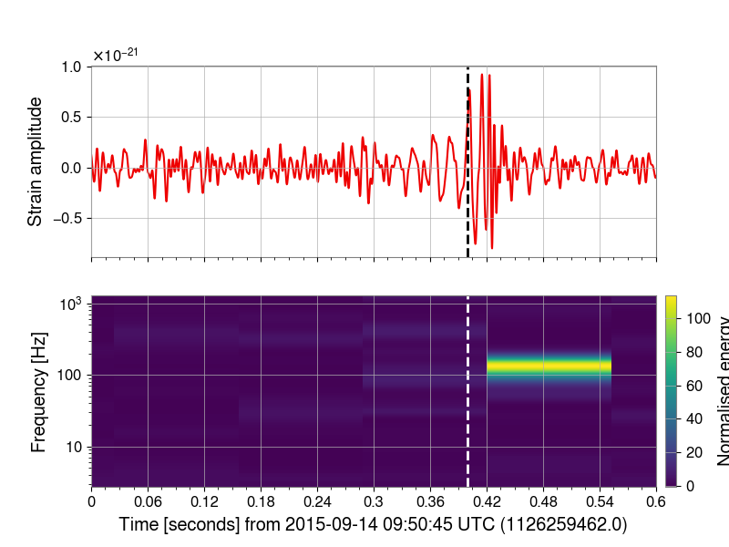
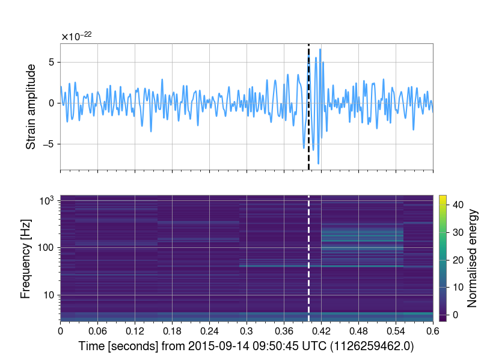
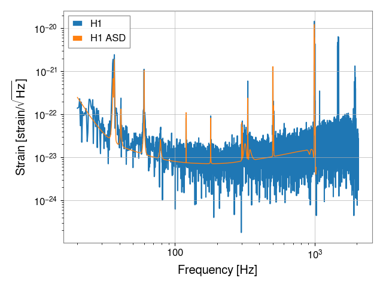
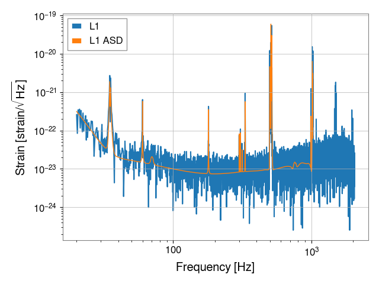

# GW170817 IMRPhenomPv2_NRTidal with parallel bilby

## Generation: downloading strain data and preparing the data_dump

The first step of the analysis is to download the strain data and prepare the `data_dump` 
file. The `data_dump` is a python pickle file containing all the preprocessing before 
sampling. We use an ini file to download the data and specify the configuration. In 
this case the file GW150914.ini:

```bash
$ parallel_bilby_generation GW150914.ini
```

The config file requires 
- the trigger time of the event
- the channel dictionary where to aquire the data from
- duration of the data to be analysed
- paths to the PSD files
- which waveform approximant to use for PE
- if to use time/distance/phase marginalisation


This step will build the lookup table for distance marginalization if required and 
also generate some figures showing the data and psd. It is recommended to sanity 
check these before continuing.

<details>
<summary>Expected logs of the generation step.</summary>

```
01:22 bilby_pipe INFO    : Command line arguments: Namespace(accounting=None, calibration_model=None, channel_dict='{H1:DCS-CALIB_STRAIN_C02, L1:DCS-CALIB_STRAIN_C02}', cluster=None, coherence_test=False, create_plots=True, create_summary=False, data_dict=None, data_dump_file=None, data_format=None, default_prior='BBHPriorDict', deltaT=0.2, detectors=['H1', 'L1'], distance_marginalization=True, distance_marginalization_lookup_table=None, duration=4.0, email=None, existing_dir=None, frequency_domain_source_model='lal_binary_black_hole', gaussian_noise=False, generation_seed=None, gps_file=None, idx=0, ignore_gwpy_data_quality_check=True, ini='GW150914.ini', injection=False, injection_file=None, injection_waveform_approximant=None, jitter_time=True, label='GW150914', likelihood_type='GravitationalWaveTransient', local=False, local_generation=False, local_plot=False, maximum_frequency=None, minimum_frequency='20', n_parallel=1, n_simulation=0, online_pe=False, osg=False, outdir='outdir', periodic_restart_time=43200, phase_marginalization=True, post_trigger_duration=2.0, postprocessing_arguments=None, postprocessing_executable=None, prior_file='GW150914.prior', process=None, psd_dict='{H1=raw_data/h1_psd.txt, L1=raw_data/l1_psd.txt}', psd_fractional_overlap=0.5, psd_length=32, psd_maximum_duration=1024, psd_method='median', psd_start_time=None, reference_frequency=20, request_cpus=1, request_memory=4, request_memory_generation=None, roq_folder=None, roq_scale_factor=1, sampler='dynesty', sampler_kwargs='Default', sampling_frequency=4096, sampling_seed=None, scheduler='condor', scheduler_args=None, scheduler_env=None, scheduler_module=None, singularity_image=None, spline_calibration_amplitude_uncertainty_dict=None, spline_calibration_envelope_dict=None, spline_calibration_nodes=5, spline_calibration_phase_uncertainty_dict=None, submit=False, time_marginalization=True, timeslide_file=None, transfer_files=True, trigger_time=1126259462.4, tukey_roll_off=0.4, verbose=False, waveform_approximant='IMRPhenomPv2', webdir=None, zero_noise=False)
01:22 bilby_pipe INFO    : Unknown command line arguments: []
01:22 bilby_pipe INFO    : Setting prior-file to GW150914.prior
01:22 bilby_pipe INFO    : Setting segment duration 4.0s
01:22 bilby_pipe INFO    : PSD duration set to 128.0s, 32x the duration 4.0s
01:22 bilby_pipe INFO    : No calibration_model model provided, calibration marginalization will not be used
01:22 bilby_pipe INFO    : Getting analysis-segment data for H1
01:22 bilby_pipe INFO    : Calling TimeSeries.get('H1:DCS-CALIB_STRAIN_C02', start=1126259460.4, end=1126259464.4, dtype='float64')
01:23 bilby_pipe INFO    : Resampling data to sampling_frequency 4096
01:23 bilby_pipe INFO    : Setting H1 PSD from file raw_data/h1_psd.txt
01:23 bilby_pipe INFO    : Using default PSD start time -128.0 relative to start time
01:23 bilby_pipe INFO    : Getting psd-segment data for H1
01:23 bilby_pipe INFO    : Calling TimeSeries.get('H1:DCS-CALIB_STRAIN_C02', start=1126259332.4, end=1126259460.4, dtype='float64')
01:23 bilby_pipe INFO    : Resampling data to sampling_frequency 4096
01:23 bilby_pipe INFO    : Getting analysis-segment data for L1
01:23 bilby_pipe INFO    : Calling TimeSeries.get('L1:DCS-CALIB_STRAIN_C02', start=1126259460.4, end=1126259464.4, dtype='float64')
01:23 bilby_pipe INFO    : Resampling data to sampling_frequency 4096
01:23 bilby_pipe INFO    : Setting L1 PSD from file raw_data/l1_psd.txt
01:23 bilby_pipe INFO    : Using default PSD start time -128.0 relative to start time
01:23 bilby_pipe INFO    : Getting psd-segment data for L1
01:23 bilby_pipe INFO    : Calling TimeSeries.get('L1:DCS-CALIB_STRAIN_C02', start=1126259332.4, end=1126259460.4, dtype='float64')
01:23 bilby_pipe INFO    : Resampling data to sampling_frequency 4096
01:24 bilby INFO    : Generating frequency domain strain from given time domain strain.
01:24 bilby INFO    : Applying a tukey window with alpha=0.2, roll off=0.4
01:24 bilby INFO    : Generating frequency domain strain from given time domain strain.
01:24 bilby INFO    : Applying a tukey window with alpha=0.2, roll off=0.4
01:24 bilby INFO    : Strain data stored in {'H1': 'outdir/data/H1_strain.hdf5', 'L1': 'outdir/data/L1_strain.hdf5'}
01:24 bilby INFO    : Completed data retrieval.
01:24 bilby INFO    : Reading in analysis data for ifo H1
/home/avi.vajpeyi/.local/lib/python3.7/site-packages/gwpy/timeseries/timeseries.py:947: UserWarning: resample() rate matches current sample_rate (4096.0 Hz), returning input data unmodified; please double-check your parameters
  UserWarning,
01:24 bilby INFO    : Data for H1 from 1126259460.3999634 s to 1126259464.3997192 s
01:24 bilby INFO    : Reading in analysis data for ifo L1
01:24 bilby INFO    : Data for L1 from 1126259460.3999634 s to 1126259464.3997192 s
01:24 bilby INFO    : Generating frequency domain strain from given time domain strain.
01:24 bilby INFO    : Applying a tukey window with alpha=0.2, roll off=0.4
01:24 bilby INFO    : Generating frequency domain strain from given time domain strain.
01:24 bilby INFO    : Applying a tukey window with alpha=0.2, roll off=0.4
01:24 bilby INFO    : Setting up likelihood with marginalizations: distance=True time=True phase=True
01:24 bilby WARNING : The waveform_generator start_time is not equal to that of the provided interferometers. Overwriting the waveform_generator.
01:24 bilby INFO    : Loaded distance marginalisation lookup table from .distance_marginalization_lookup.npz.
01:24 bilby INFO    : Generation done: now run:
mpirun parallel_bilby_analysis outdir/GW150914_data_dump.pickle

```

</details>

<details>
<summary>Expected plots of the generation step.</summary>






</details>


## Analysis: run the analysis under MPI

Once one has a data dump file, you can now run it under MPI. To check that
things work okay, on a head done you can run
```bash
$ mpirun parallel_bilby_analysis outdir/GW170817_data_dump.pickle
```
This will start sampling using the maximum number of cores available on a head
node, typically 3 or 4. To deploy the analysis at scale, you'll need to submit
it to the scheduler. We give an example below for a slurm scheduler.

On completion, this will generate a file `outdir/GW150914_result.json` which
contains the posterior as sampled.

## Post-process: run the post processing step

The sampling itself generates samples only in the sampled parameters. We
include a postprocessing step to generate samples in the parameter available
by conversion (i.e. componant masses) and the parameters which are marginalised
during sampling. This, like the analysis step, should be run under mpi, e.g.

```bash
$ mpirun parallel_bilby_postprocess outdir/GW150914_result.json
```

## Condor submit script

For either the analysis or post-processing steps, you should submit the job to
run on a cluster, leveraging a number of parallel cores. As an example, here is
a slurm submit script for running the analysis step above using 16 cores with MPI:

`run_pbilby.sh`
```ini
universe = parallel
accounting_group = ligo.dev.o3.cbc.pe.lalinference
executable = <PATH/TO/YOUR/MPIRUN/EXECUTABLE>
arguments = -n <NUMBER_CORES> <PATH/TO/parallel_bilby_analysis>  
outdir/GW_data_dump.pickle
output = outdir/log_data_analysis/pbilby.out
error = outdir/log_data_analysis/pbilby.out
log = outdir/log_data_analysis/pbilby.out
machine_count = <NUMBER_CORES>
queue
```

Here, we have shown an example which first sources a conda environment, you
should edit this to ensure the correct environment with `parallel_bilby` and its
dependencies is available.

Having written this file, you can submit it with
```bash
$ condor_submit run_pbilby.sh
```


